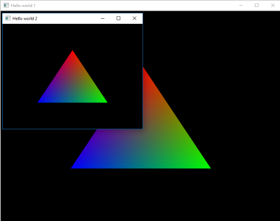
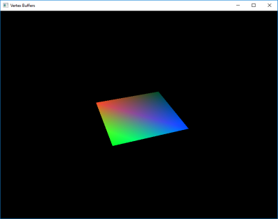
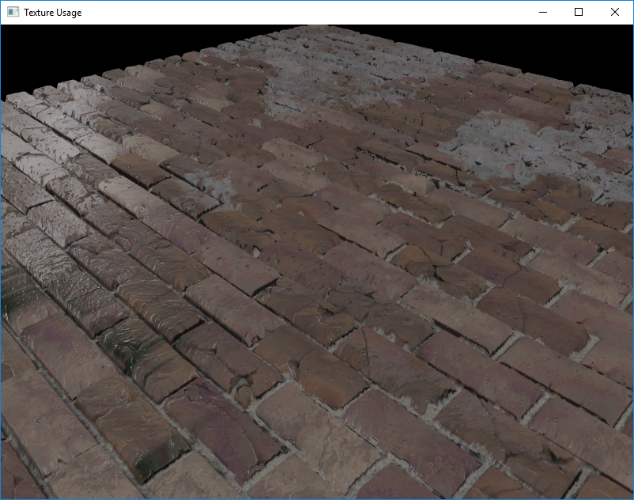

# VulkanRI Examples
	
## 1. hello_world

 Covers the following:
 * how to initialize the render interface
 * setup the validation report layer
 * create two windows and their corresponding surfaces
 * initialize a device context with the swapchain extension/feature
 * construct the shader pipeline with a simple vertex and fragment shader
 * construct render pipeline with a single pass
 * use dynamic state for viewport changes for each window on the render pipeline
 * surface acquire and presentation
 * surface recreation upon resizing
 * two presentation modes, recorded and transient modes

## 2. buffer_usage

 Covers the following:
 * creating vertex, uniform and index buffers
 * creating and using an input layout
 * seting an indexed input layout, it's vertex binding and attributes
 * use indexed draw commands
 * using transfer operations with a staging buffer
 * adding debug tags to resources
 * how to create and set uniform buffers
 * creating descriptor set and layouts via a descriptor pool
 * using push constants

 ## 3. textures_usage

 

 Covers the following:
 * creating multiple textures
 * loading multiple textures using a staging buffer
 * mip-map generation for the textures
 * setting up the depth buffer
 * enabling MSAA and sample shading
 * a simple PBR shader with multiple lights
 